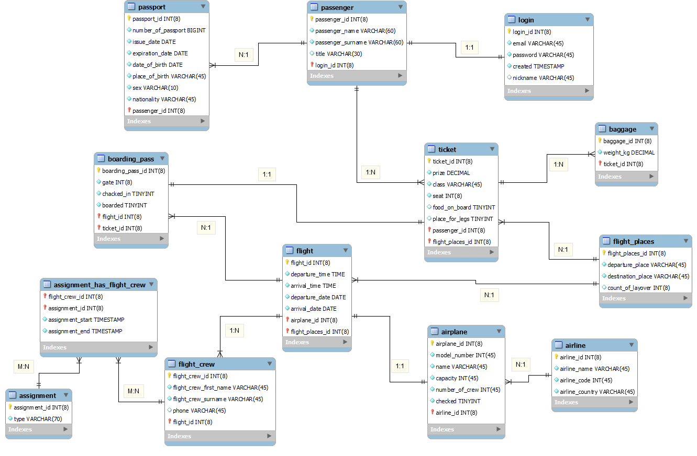

# Database Security Subject Project - Flight System Database Application

## Introduction
The goal of this project for the Security of database systems course is a basic
introduction to the database design and the design in PostgreSQL and
MySQL languages. When designing the tables, we used the MySQL Workbench program,
which generated the bulk of the DDL code. Then we modified the DDL 
code and applied it to the pgAdmin 4 database system. We
also remodeled this database into the phpMyAdmin system. Once the tables
were created, we filled the tables with relevant data.

Our project is focused on creating a system that can be used as an airport
database. Passenger will be able to register in our system, where he
will be able to order a ticket. The tables store the relevant information about
the person and the flight they will travel with. A total of 13 tables were 
created that use all database relationships such as 1:1, 1:N, M:N. The database
is designed to meet the 3rd normal form.

This document contains a theoretical part in which we describe the individual
SQL languages and platforms that we will use in this project. Furthermore,
schemes and diagrams of our system, where you can see in detail
the structure of individual tables and their connections. You can find the
individual DDL and DML codes in the attachments.

## Description
The main task of this project was to come up with a topic on which we
demonstrate the design of tables and the subsequent application of SQL
functions. We chose a flight system theme because we like to travel to foreign
 countries by the already mentioned plane. Note: Statistics show that
travelling by airplane is one of the safest means of transportation in the
world.

The user logs into our system using a login, where he enters his unique
e-mail and a secure password. For easier logging in, the user can also enter
a nickname. Once the user is logged in (registered), he fills in his first name,
last name and relevant information about his passport. The passport is
used for checking and better identification of the person before boarding
the plane.

The main function of the database is to order tickets online. The user
chooses where, where, when and at what price he will travel. When buying
tickets, the user chooses the place where he will sit. As some passengers
demand luxury, we offer individual classes such as standard, relax and
business. In the plane, you can also find seats with more legroom, which
are especially suitable for tall people. Of course, these seats have a higher
price.

Especially for longer flights, there is the possibility to buy food on board.
This service is becoming more and more popular mainly in business class,
where nowadays the crew can also prepare multi-course meals. When ordering
a ticket, we must not forget the passengers’ luggage. In our system,
the price depends on the weight of the luggage.

As soon as the passenger buys a ticket, a boarding pass is automatically
generated for him, where he can find information such as the gate number,
where he will board the plane. Check-in and boarded values are written as
True and False in the database. It is checked if the passenger performes the
given action.

In the last part of the database, we created tables where you can find
what kind of plane you fly and what company owns the plane. We must
also not forget the crew of the aircraft and their functions such as pilot or
flight attendant.

## Application
In this project I implemented database design into a working application. Through the application, which has a log-in feature, you can view all passengers with their emails and some other personal information. I also implemented CRUD operations on the flight entity, which means I can create, read, update and delete flights in my database. 

I drew from my first assignment, which was the database design of a flight system, which could store data such as information about passengers, information about various flights and information about pilots and airplanes. I also drew from my second assignment, which focused on working with the database through complex queries. 

The program will simulate a flight system database where you can browse peoples account, with their email addresses. The next functionality is to work with flight, you can create, read, update and delete them. Another functionality is a log-in window, where you can log-in with email address and the right password. 

Passwords are stored in the database in hash form, the application then hashes the password, which the user entered. The two hashes are then compared and if they are not the same, then a pop-up window will appear, displaying that the user has entered the wrong password. 

The program is written in Java programming language, with the help of Apache Maven. The database is local-hosted with PostgreSQL and is accessed through PgAdmin. In the second assignment I created a no-superuser role from which I accessed the database. Its best not to use the superuser role, because if the role gets compromised, the hacker can't destroy the database in the process. 

## Installation
Make sure you have the latest version of Apache Maven.

After that, use this command to build the project (in the right directory):
```
mvn clean install
```

Then you can run the program with this command:
```
java -jar target/flight-1.0.0.jar
```

You need a working PostgreSQL database for the application to work!

## ERD Diagram
Entity-relationship diagram is used for abstract and conceptual representation
of data. As you can already see in the image below, it is a massive
amount of blocks connected by lines. Individual blocks represent attribute
tables. Connecting lines represent relationships that occur between
tables. In our system we use all relationships such as 1:1, 1:N, M:N. Note
We use BOOLEAN instead of TINYINT as mentioned in the diagram because
 Workbench cannot use this data type




## Funcional and Non-funcional requirements
F: The system must enable the purchase and further administration
of services entirely via the Internet.

N-F: The system can be registered in using an email and has to allow
the setting of a nickname to simplify the login process.

F: Login must be secure and has to allow at least one other form of
security measure in addition to a password.

N-F: Login password must be at least 10 characters long and enable
2-factor authentication.

F: When purchasing a product or service on the website, a confirmation
has to be displayed to the account and sent to an email

N-F: Confirmation to the account must arrive within 10 minutes of
performing the activity and confirmation to the email must arrive
within 30 minutes of the purchase.

F: The system must inform the customer about changes in departure
times or other technical difficulties.

N-F: The system will always send an email to the customer in the
event of technical problems within 10 minutes at the most from the
detection of the defect or to the phone in the form of a SMS message,
if the customer requests it in advance in the system, with the same
time period.

F: The system has to allow to change or cancel a ticket.

N-F: The customer can cancel or change the ticket up to 24 hours before
departure. After this time, the customer must use the ticket or let
it be forfeited.

## Project status
This is a finished project, although it could use some quality of life features.

## Authors and acknowledgment
Petr Bráblík - developer and designer,
Martin Hanták - designer

## License
Copyright 2022 Petr Bráblík

Licensed under the Apache License, Version 2.0 (the "License"); you may not use this file except in compliance with the License. You may obtain a copy of the License at

http://www.apache.org/licenses/LICENSE-2.0

Unless required by applicable law or agreed to in writing, software distributed under the License is distributed on an "AS IS" BASIS, WITHOUT WARRANTIES OR CONDITIONS OF ANY KIND, either express or implied. See the License for the specific language governing permissions and limitations under the License.


